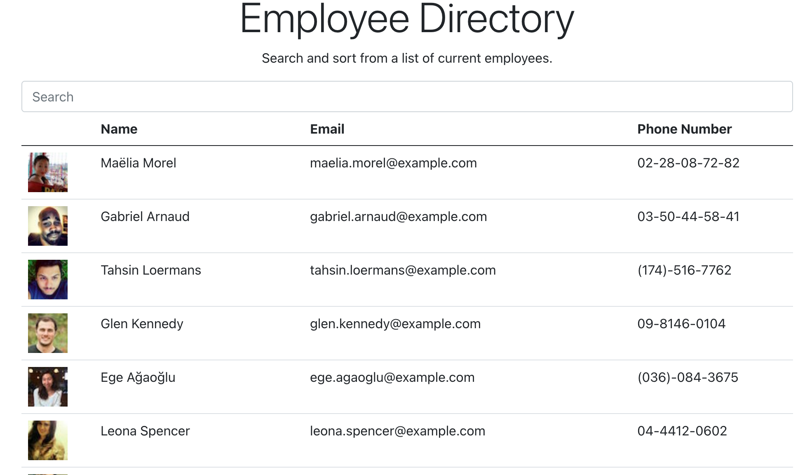

# React Employee Directory

## Description

This app is designed with both managers and employees in mind offering them the power to quickly search the employee directory to gain access to basic employee contact information. For the sake of efficiency it offers users the ability to filter employees by the name column and/or search the entire database by name.

## Table of Contents
*[Installation] (#installation)
*[Usage] (#usage)
*[License] (# license)
*[Contributing] (#contributing)
*[Tests] (#tests)
*[Questions] (#questions)

## Installation
npm i
npx create-react-app my-app

## Usage
Utilize API to access employee data and return search results.

## License
N/A

## Contributing
N/A

## Tests
No testing is required for this application.

## Questions or Connection
I am open to questions and suggestions regarding this and all projects. Feel free to contact me directly at monica.r.hill@gmail.com. You can view more of my projects at https://github.com/acinom813. 

## Links

Github: https://github.com/acinom813/react-employee-directory

Deployed: https://acinom813.github.io/react-employee-directory/